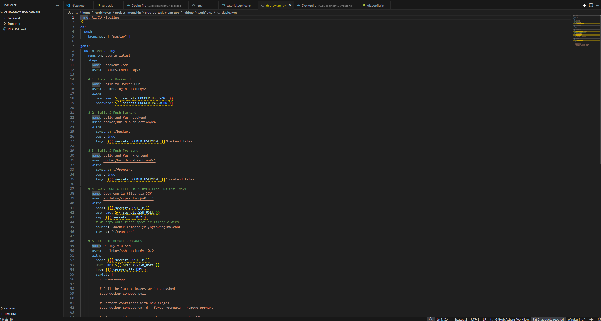
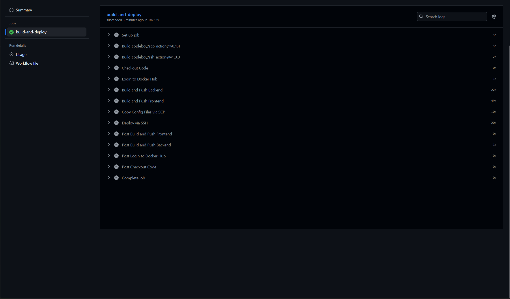
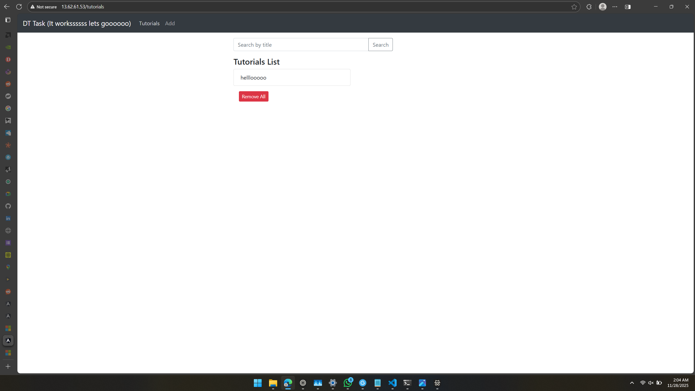
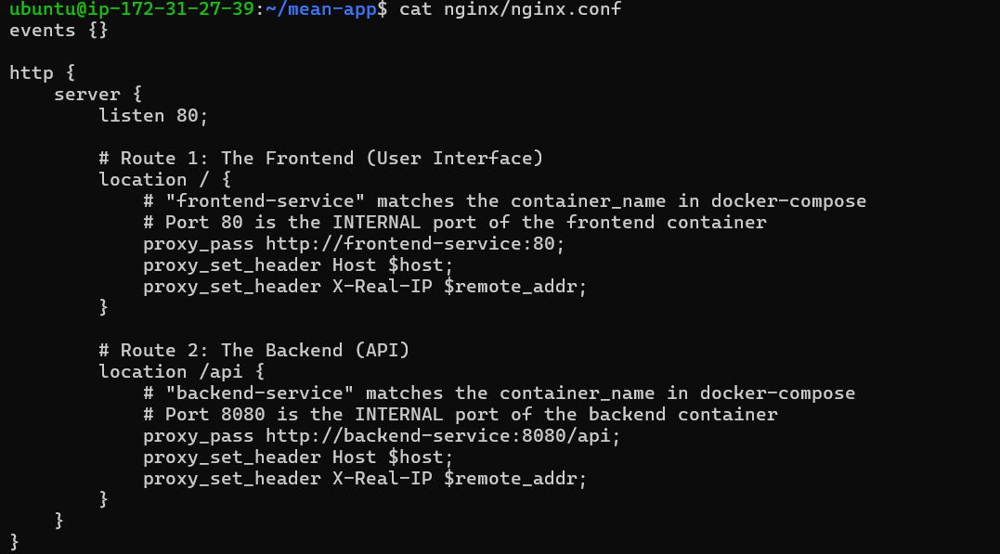
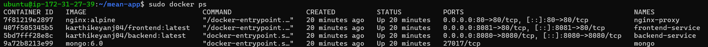

# MEAN Stack DevOps Task

This repository contains a full-stack MEAN application (MongoDB, Express, Angular, Node.js) deployed using Docker and GitHub Actions.

The application is containerized with Docker Compose and deployed to an AWS EC2 instance. It uses Nginx as a reverse proxy to route traffic on Port 80, eliminating CORS issues and serving as a single entry point.

## Project Structure
* **Frontend:** Angular 15 (Multi-stage Docker build served via Nginx Alpine)
* **Backend:** Node.js Express API
* **Database:** MongoDB 6.0
* **Proxy:** Nginx (Gateway)
* **CI/CD:** GitHub Actions (Build, Push, Deploy)

---

## Proof of Execution

### 1. CI/CD Configuration & Execution
GitHub Actions workflow (`deploy.yml`) and successful execution logs.



### 2. Docker Build & Push
Build logs from the pipeline and verified images on Docker Hub.


### 3. Application Deployment
Live application running on AWS EC2. The data shown proves the database connection is active.


### 4. Nginx Setup & Infrastructure
Nginx configuration (`nginx.conf`) showing the proxy logic, and `docker ps` output showing the gateway running on Port 80 routing to internal services.



---

## Setup Instructions

### Prerequisites
* Docker & Docker Compose
* Node.js (for local dev)
* AWS EC2 (Ubuntu 22.04) for deployment

### Local Setup
1.  Clone the repository:
    ```bash
    git clone [https://github.com/karthikeyanj04/YOUR-REPO-NAME.git](https://github.com/karthikeyanj04/YOUR-REPO-NAME.git)
    cd YOUR-REPO-NAME
    ```

2.  Start the services:
    ```bash
    docker-compose up -d --build
    ```

3.  Access the app:
    * Frontend: `http://localhost`
    * API: `http://localhost/api`

### CI/CD Deployment
The project uses `.github/workflows/deploy.yml` for automated deployment.

1.  **Secrets Configuration:**
    Ensure the following secrets are set in the GitHub repository:
    * `DOCKER_USERNAME` / `DOCKER_PASSWORD`
    * `HOST_IP` (AWS Public IP)
    * `SSH_USER` (default: ubuntu)
    * `SSH_KEY` (PEM file content)

2.  **Trigger:**
    Pushing to the `main` branch triggers the pipeline. It builds the images, pushes to Docker Hub, copies the configuration files to the server via SCP, and restarts the containers.

### Manual Server Deployment (Optional)
If deploying manually without the pipeline:

1.  Install Docker on the VM:
    ```bash
    sudo apt update && sudo apt install docker.io docker-compose-v2 -y
    sudo usermod -aG docker $USER
    ```

2.  Copy `docker-compose.yml` and the `nginx/` folder to the server.

3.  Run the application:
    ```bash
    docker compose up -d
    ```
